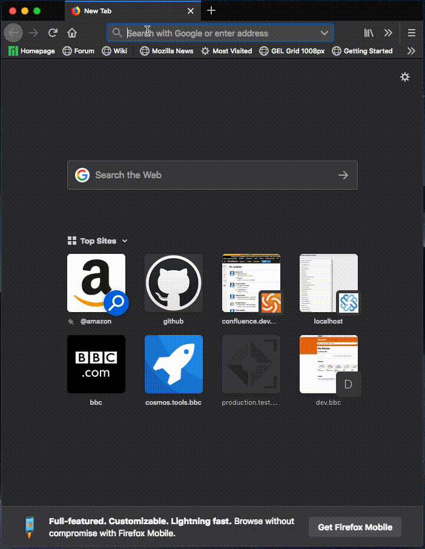
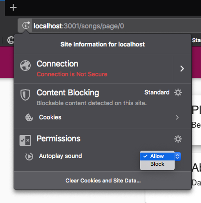

# 🤘 Rocanrol Client

Rocanrol is a basic audio file server. This repo contains the code for Rocanrol Client, the web client for the service that lives [here](https://github.com/aadroher/rocanrol).



## Installation

### Node version

As specified in the `.nvmrc` file, this service has only been tested on Node 12.7. It may work in older (but modern) versions of Node, but run it on >12.0.0 for best results.

## Dependencies

As expected, the dependencies are installed by running:

```
npm install
```

This project is an ejected instance of [create-react-app](https://create-react-app.dev/). This is why it has such a huge number of dev dependencies. Some cleanup is needed in order to leave only the ones needed.

## Test

As usual, tests may be run with:

```
npm test
```

The tests generate a coverage report. The current test coverage is _really_ poor.

## Run the app

At the time of writing, the web client can only be run in development mode, in other words, on then Webpack development server. When run in this mode, it fetches the service data from `localhost:3000`, since all requests to `/api` will be proxied to this endpoint, as defined in [`src/setupProxy.js`](src/setupProxy.js). 

Therefore, the service needs to be running in order for this web app to run properly.

### Start the service

See the instructions in the `README.md` file of the [rocanrol repository](https://github.com/aadroher/rocanrol) to set up and run the service. 

Neither that nor this applications are versioned. Please make sure that you have first pulled `master` and have the last version of the audio data file before proceeding to setting it up and running it.

### Start the client

Once the `rocanrol` service is running on port 3000 type the following command in the root folder client to start the development server.

```
npm start
```

The client will then be served from `http://localhost:3001`.

### Allow audio playback

Rocanrol Client does not currently prompt the user asking for permission to play audio. Some browsers give them it automatically and some silently fail to do so (e.g. Firefox). Make sure that you have configured the site to allow audio playback:



### Interact with the client

Enjoy the music!

## Internal architechture

Rocanrol Client is built on top of React and Redux, and the interface uses components from Material UI. The routes are managed by React Router.

As expected, the different files and directories under `/src` contain the following elements:

- `/app.jsx`: The main React component, which is the entry point of the application.
- `/styles`: Contains the theme configuration to pass to the MUI theme provider.
- `/components`: The presentational React components that are used throughout the application. Most of its organisation is still flat, except for `/components/hocs`, that contains the only higher order component defined.
- `/containers`: The store-aware connected components, which map both the state and the action dispatchers to the presentational components props.
- `/actions`: Includes a single file with all the actions defined in the system.
- `/reducer`: As the name implies, the collection of reducers which, combined, update the store when receiving dispatched apps.
- `__test__`: The few tests written so far live here.

The audio itself is managed by wrapping an `<audio>` element with the `<AudioPlayer>` component. The interaction with the imperative interface of this DOM element is triggered by the change of values of its props.

## What is missing